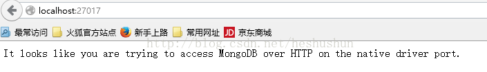

# 搭建本地mock数据

### 安装工具

- nvm

  - [windows](<https://blog.csdn.net/qq_32682137/article/details/82684898>)
    - 小坑： nvm install 8.11版本以上，不会成功安装对应的npm，需要我们手动去[官网](https://npm.taobao.org/mirrors/npm/)安装
      - 1. 下载手动安装对应的npm版本
        2. 进入nvm下的指定的node版本目录发现目录下没有npm运行文件
        3. 进入node_modules发现文件夹为空
        4. 解压后将文件夹重命名为npm并复制到node_modules目录下
        5. 最后将npm中bin目录下的npm以及npm.cmd复制到与node_modules目录同级目录下
  - [mac](<https://www.jianshu.com/p/622ad36ee020>)

- easy mock 很奇怪。目前只能支持node 8.x版本的

  `nvm install 8.16.0`

- mongodb

  - [windows](<https://blog.csdn.net/heshushun/article/details/77776706>)
  - [mac](<https://www.jianshu.com/p/bb7c19c5fc47>)

- redis

  - [windows](<https://www.cnblogs.com/smilepup-hhr/p/11483915.html>)
  - [mac](<https://www.jianshu.com/p/bb7c19c5fc47>)

- 克隆easy-mock项目

  - `git clone https://github.com/easy-mock/easy-mock.git`

### 起服务

- mongodb
  - `mongodb`
  - 小tips：如果没有配置本地window服务，则需要：
    - 在mongodb的bin目录（Jxiang的电脑: D:\Program Files\MongoDB\Server\4.2\bin）
    - **输入如下的命令启动mongodb服务：mongod --dbpath D:\software\MongoDB\data\db**
    - **在浏览器输入http://localhost:27017 （27017是mongodb的端口号）查看，若显示以下则表示成功：**
    - 
- redis
  - `redis-server`
  - 小坑：按照网址里面安装完redis后，有一个设置密码的步骤。这里建议不要设置。或者设置完，再重新置空。因为最后跑easy-mock的时候，需要认证（会报错）。但是我不知道怎么输入密码。
- easy-mock
  - `npm i`
  - `npm run dev`
  - 小坑： `npm run dev`以后，在浏览器打开`0.0.0.0：7300`会出现地址不存在的情况，这时候去源码中 `easy-mock/config/default.json` 修改 `host` 为 `localhost`