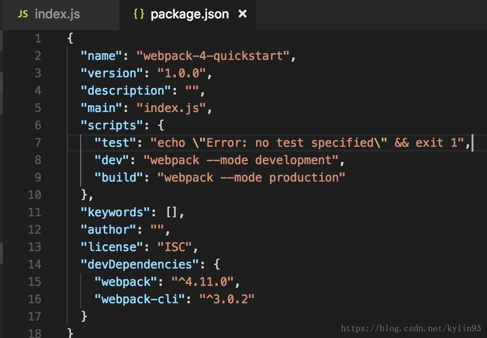

> ## 快速搭一个webpack4项目

* ### mkdir webpack-4-quickstart && cd $_

* ### npm init -y 

* ### npm i webpack webpack-cli --save-dev 
    - 在wepack4中 webpack-cli抽离了出来, 需要分开安装

* ### 创建入口文件, 配置package.json进行打包
    - webpack4中默认将 ./src/index.js作为入口文件
    
    - 创建./src/index.js文件, 将如下内容复制进去!
        ```js
          console.log(`i'm a silly entry point `)
        ```
    - 在package.json中配置脚本, 在webpack中需要配置生产和开发模式
        ``` json
            "scripts": {
                "dev": "webpack --mode development",
                "build": "webpack --mode production"
            }
        ```
        
    
    - 执行命令:
        ```
          npm run build 生产模式
          npm run dev   开发模式
          开发模式针对速度进行了优化, 只不过是提供未缩小的捆绑包
        ```

* ### 覆盖默认入口出口配置
    ``` json
        "scripts": {
            "dev": "webpack --mode development ./foo/src/js/index.js --output ./dist/main.js",
            "build": "webpack --mode production ./foo/src/js/index.js --output ./dist/main.js"
        }
    ```
    - 修改配置package.json文件, 然后打包的时候回去找入口文件(./foo/src/js/index.js), 并在(./dist/main.js)输出